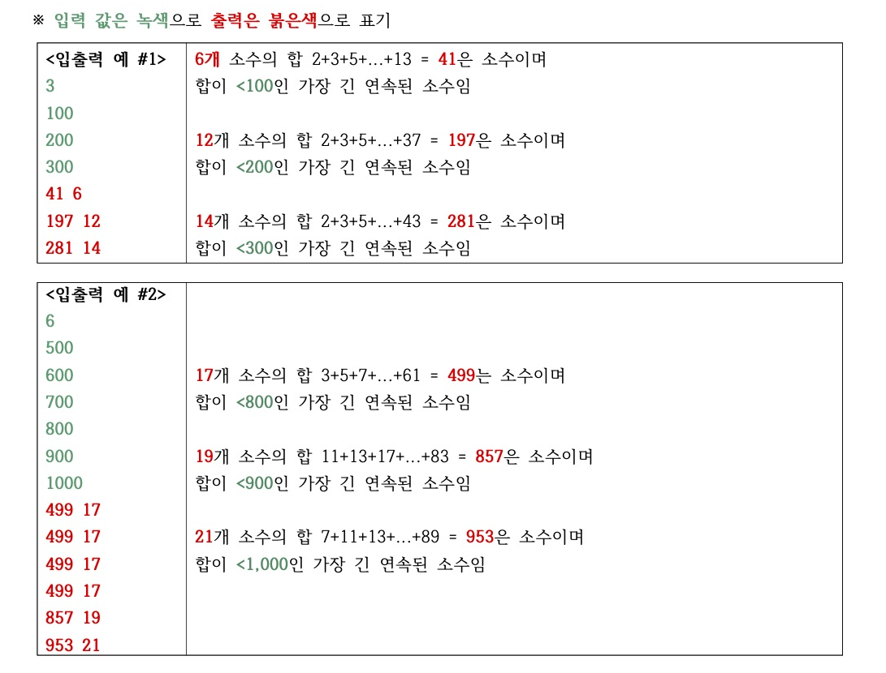

# 고급문제해결, 8주차 과제 문제 1

고급문제해결, 8주차 과제
**효율적인** 코드 짜기


## 문제

- 입력으로 먼저 테스트 케이스 수인 정수 T를 받고 **(1<=T<=10)**
- T에 기술된 개수만큼 **정수 N**을 받음 **(3<=N<=100,000)**
- (i) **합이 소수**이면서 (ii) **<N인** (iii) **가장 긴** (iv) **연속된 소수**를 찾아
- 그 **합**과 **길이**를 **공백으로 구분**하여 출력

## 출력 예시




## 문제 유형

You can rename the current file by clicking the file name in the navigation bar or by clicking the **Rename** button in the file explorer.

## Flow Chart


```mermaid
graph TD
A[T 입력] -- T에 기술된 개수만큼 --> B[정수 N 입력]
B --> B2[maxN 구하기]
B2 --> C[2-maxN 소수 배열 구하기]
C -- 앞에서 구한 소수 배열 사용해서 --> D[소수의 합 테이블 구하기]
D -- 첫 라인만 이진탐색 --> E[Right Border index 찾기]
E --> F[Left Border부터 max-length 수열 찾기]
F -- 다음 라인, 수열 > max-length만 탐색 --> E
F --> G[합, 길이 출력]
G -- T만큼 반복 N 배열 --> E
# A --> C(Round Rect)
# B --> D{Rhombus}
```